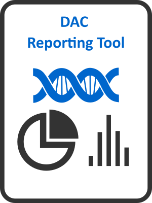

# DAC-Report


This project is internal for a POC of automatic dbGaP reporting for Data Access Committees



# Downloading the package

To download the package, use

```
install_github("https://github.com/cmarcum/DAC-Report/tree/devel") 
```
# Data Source
We use the [dbGaP Data Access and Use Report page](https://www.ncbi.nlm.nih.gov/projects/gap/cgi-bin/DataUseSummary.cgi) as our primary data source and this package serves as a programmatic interface to easily retrieve the data and automatically generate an DAC-specific data report. Currently the package stores all DAC action data (last update: 11/04/2020) locally [(example)](https://www.ncbi.nlm.nih.gov/projects/gap/cgi-bin/DataUseSummary.cgi?DAC=all&actType=all&stDate=04/23/2020&endDate=10/22/2020]). To load the data into R environment use:
```
library(DACReportingTool)
data("nih_dac_action_table")
```
And to update all locally stored data with the latest information from dbGaP, use:
```
update.every.table()
```

# Tables Available

One of the main goals of the package is to make summary statistics of DAC activities data easily accessible. Here are some of the tables that can be computed using this package:

`nih_dac_action_table`, for table schema see and example [link](https://www.ncbi.nlm.nih.gov/projects/gap/cgi-bin/DataUseSummary.cgi?DAC=all&actType=all&stDate=04/23/2020&endDate=10/22/2020)

`all_nih_studies_table` for table schema see [link](https://www.ncbi.nlm.nih.gov/projects/gap/cgi-bin/DataUseSummary.cgi?stDate=04%2F28%2F2020&endDate=05%2F28%2F2020&retTable=tablea1) (equivalent of table a1)

`get.study.summary.table()`
Returns a summary dataframe of all DAC which had DAR approved in the given timeframe. See documentation for table schema.

`dar.review.timeline.summary()`
Returns a summary dataframe of all studies made in the given timeframe. Note that some studies can be both approved and rejected (ex. approved but later rejected ), or neither (still in process of approval) so it isn't necessary that Total Request = Approval + Reject. See documentation for table schema

For a complete list of all available tables, see files under the R/ directory and their associated documentation.

# Report Generation

One of the features of this package is the ability to generate a DAC-specific summary report for a given window of time. For example, to generate the NIAID DAC report for all activities occurring between the first of January, 2015 and the end of June, 2015: 

```
compile.dac.report(dac='NIAID',author='Hoyin Chu, Christopher Marcum', start.date='2015-01-01', end.date='2015-06-30')
```

This function uses an internal R Markdown template that compiles its output to a Microsoft Word (.docx) document. The report will automatically open using whatever compatible software you have available (i.e., MS-Word, Office 365, LibreOffice). The report contains figures, tables, and basic summary interpretation. Be sure to save this report to your Desktop or other appropriate location as it is only stored in a temporary location while it's open. Close the opened .docx file before generating a new one to avoid errors.
