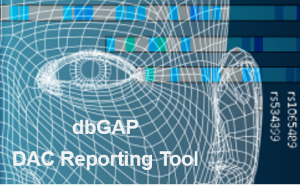

# DAC-Report
This project is internal for a POC of automatic dbGaP reporting for Data Access Committees



Currently we use the [dbGaP Data Access and Use Report page](https://www.ncbi.nlm.nih.gov/projects/gap/cgi-bin/DataUseSummary.cgi) as our primary data source and this package serve as a programmatic interface to easily retrieve the data

# Workflow
The package stored all DAC action table data [(example)](https://www.ncbi.nlm.nih.gov/projects/gap/cgi-bin/DataUseSummary.cgi?DAC=all&actType=all&stDate=04/23/2020&endDate=10/22/2020]) till 10/22/2020. To access the data simply call
```
my_table <- DACReportingTool::nih_dac_action_table
```
To update the dataframe with the latest data you would need to access the `/data` directory which means you need to clone the repository. After doing so, you can build the package and update the data by doing:
```
> library('devtools')
> load_all()
> update.dac.action.table()
```
and it will update the table with the latest data! (Remember to reload!)

# Data Available

`nih_dac_action_table`, for table schema see and example [link](https://www.ncbi.nlm.nih.gov/projects/gap/cgi-bin/DataUseSummary.cgi?DAC=all&actType=all&stDate=04/23/2020&endDate=10/22/2020)

`all_nih_studies_table` for table schema see [link](https://www.ncbi.nlm.nih.gov/projects/gap/cgi-bin/DataUseSummary.cgi?stDate=04%2F28%2F2020&endDate=05%2F28%2F2020&retTable=tablea1) (equivalent of table a1)

`get.study.summary.table()`
Returns a summary dataframe of all DAC which had DAR approved in the given timeframe. See documentation for table schema

`dar.review.timeline.summary()`
Returns a summary dataframe of all studies made in the given timeframe. Note that some studies can be both approved and rejected (ex. approved but later rejected ), or neither (still in process of approval) so it isn't necessary that Total Request = Approval + Reject. See documentation for table schema
